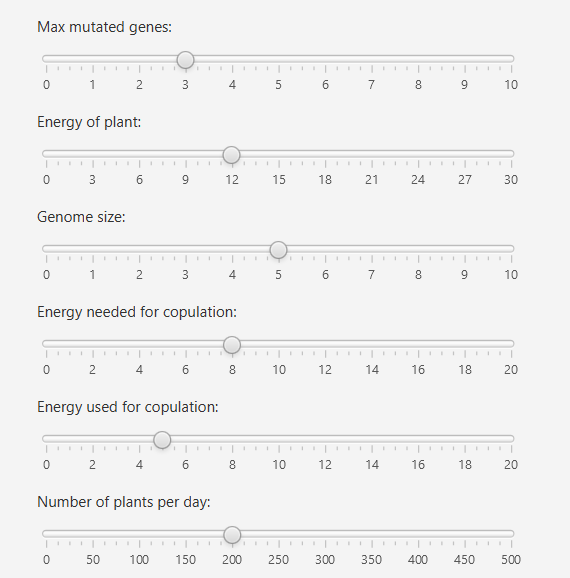
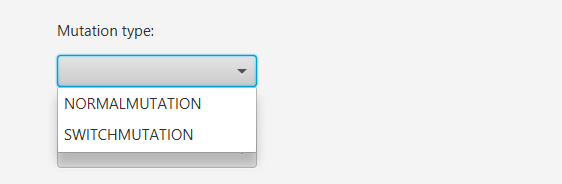
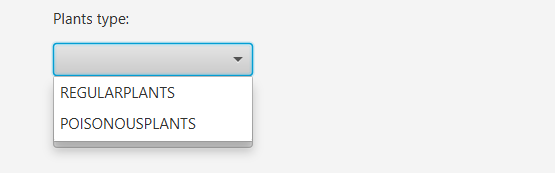
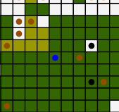
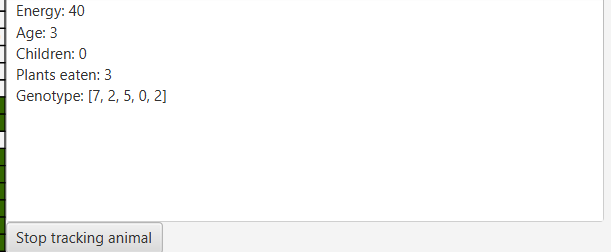

Darwin World Simulator

## Description
This code simulates the evolution of animals in a world. The world is a 2D map with a grid of fields. Each field can be empty or occupied by an animal. Animals can move, eat, reproduce and die. The simulation is based on the following rules:
- Each animal has a set of parameters: energy, age, children, plants eaten and genotype. Energy and genotype are inherited by offspring with some mutations.
- Each animal has a set of genes that determine its behavior. The genes are inherited by offspring with some mutations.
- Each animal has a set of actions that it can perform: move, eat, reproduce.
- If an animal has no energy, it dies.
- We can choose mutation and plants types.

Choosing parameters:

Choosing types:

Generated world map (first day):

Second day - first animal moves:

Showing parameters:

Choosing animal to track:

Tracking animal parameters:

